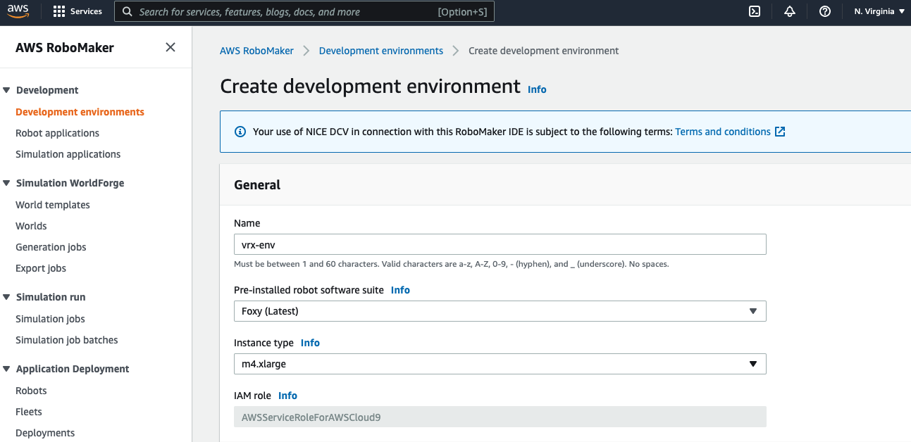
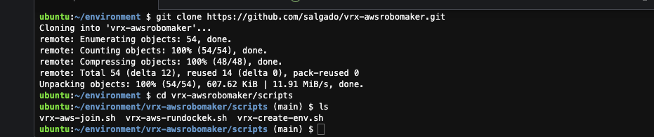

# vrx-awsrobomaker

# VRX on AWS RoboMaker 

## Introduction

These steps will guide you through creating a VRX ROS environment in the Cloud using AWS RoboMaker.

  


## Step 1: Create a AWS Account

In order to use AWS RoboMaker, do you need an account, see the link below to create: [How do I create and activate a new AWS account?](https://aws.amazon.com/premiumsupport/knowledge-center/create-and-activate-aws-account/) 

## Tutorial

This tutorial has three parts explained in detail

*   Part 1 - Create a ROS development environment
*   Part 2 - Configure VRX
*   Part 3 - Test and run the VRX basic application

## Part 1 - Create a ROS development environment

To create your VRX robot application, you need an environment configured for ROS development, build tools like Colcon and some helper tools like Gazebo simulator, rviz, etc.

### 1.1 - Create a development environment

To get started with this tutorial, we’re going to create an AWS RoboMaker integrated development environment (IDE). From the **AWS RoboMaker** menu, select **Development Environments** then **Create development.** 


Currently, AWS RoboMaker offers native support for Melodic(ROS1) or Foxy(ROS2) distro. But for our VRX environment, we will follow docker vrx installation process to accomplish the ROS Noetic competition config requirements.

We have tested this using the US East(N. Virginia) region; please send us an issue if you successfully run in another region.


Name your environment **vrx-env**, choose **Foxy (Latest)** as your ROS distribution and **'m4.xlarge'** as the instance type...





... then click Create.


After a few seconds, you should see the development environment appear.


## Part 2 - configure VRX

To create the vrx-ROS-ready environment, you could use the link, https://github.com/osrf/vrx/wiki/system_setup_tutorials. But we customize the main commands in some scripts to a fast installation process. Follow the instructions below.

### 2.1 - Download the scripts

In the lower window pane of the development environment, use a bash terminal to download this repository. 

```bash
git clone https://github.com/salgado/vrx-awsrobomaker.git
cd vrx-awsrobomaker/scripts
ls
```

You must see the files below



### 2.1 - Install dependencies and run docker

Inside vrx-awsrobomaker directory run...

```bash
bash vrx-create-env.sh
```

...and proceed with the installation. ** if you asked about "Do you want to continue? [Y/n] ", just hit `<ENTER>` to accept **

It could take about 8 minutes to finish the installation until this message stop the process.  


Now you have a ROS running inside docker container.
Just type ```rosversion -d``` and check "noetic" response.
  
  
## Part 3 - Create a VRX Workspace and run a basic application
  
### 3.1 - Type (or copy/paste) the commands to create your vrx workspace  

```bash
#inside the docker
mkdir -p ~/vrx_ws/src
cd ~/vrx_ws/src

git clone https://github.com/osrf/vrx

# Build and Run the VRX Simulation Platform

source /opt/ros/noetic/setup.bash
cd ~/vrx_ws
catkin_make

# run
source ~/vrx_ws/devel/setup.bash
  
echo "Congrats!! You have finished vrx installation!"
```  
You should receive the response Congrats!!.


### 3.2 - Run a basic application  

To run simulations and ros command, we will use "virtual desktop" from AWS Robomaker. 
For the final part of this tutorial, open a tab clicking on menu "Virtual Desktop" then "Launch Virtual Desktop".  


  

Obs: ** If you open a blank tab, please close that an repeat the 3.2 step again **

Inside the Virtual Box, click on "Activities" | type "terminal", select Xterm terminal window...

  

.. and type the following commands

Join docker noetic
  
```bash  
# join docker noetic
cd ~/environment/vrx-awsrobomaker/scripts
bash vrx-aws-join.sh 
```

Launch vrx-ros-project and gazebo
```bash
# launch vrx-ros-project and gazebo
cd ~/environment/vrx-awsrobomaker/scripts
bash vrx-aws-launch-gazebo.sh
```

### 3.3 - From ZERO to VRX

Congrats!! Now you have VRX ROS Up and running on AWS RoboMaker.

  


